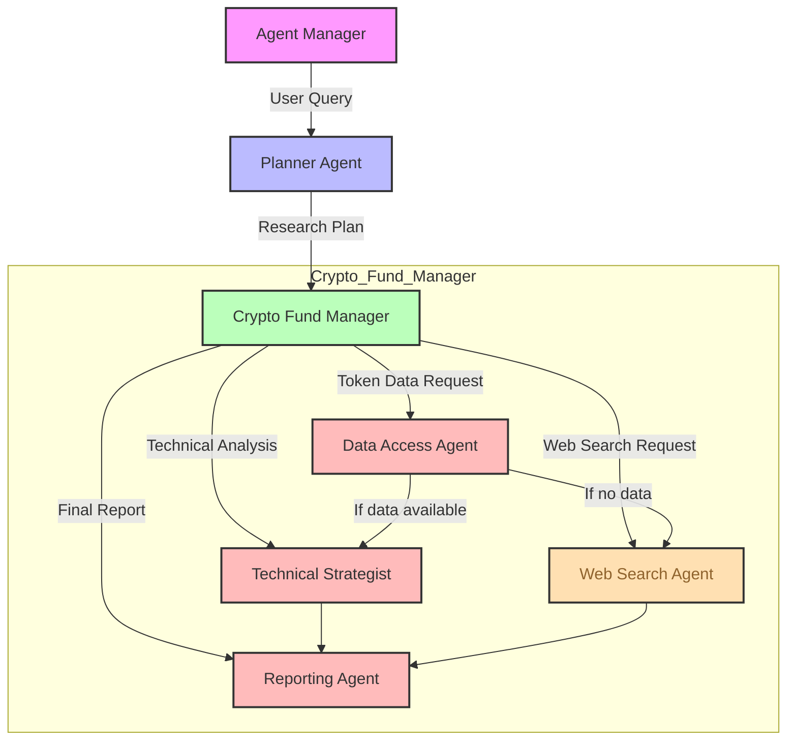

# Agent Flow Explanation

## 1. AgentManager to Planner Agent
- **Trigger**: User submits a query
- **Action**: Planner Agent analyzes if query is crypto-specific
- **Output**: Creates research plan with API data collection or web search fallback

## 2. Planner to Crypto Fund Manager
- **Trigger**: Receives research plan
- **Action**: Coordinates between sub-agents based on plan type
- **Handoff Rules**: Never performs multiple handoffs - chooses either API or web search path

## 3a. Data Access Agent
- **Trigger**: Crypto-specific query with token details
- **Action**: Fetches data from Mobula and CryptoPanic APIs
- **Handoff**: If no data, hands off to Web Search Agent

## 3b. Web Search Agent
- **Trigger**: Non-crypto query or API data unavailable
- **Action**: Performs web search using fallback plan
- **Output**: Provides web-based insights

## 4. Technical Strategist
- **Trigger**: Valid API data available
- **Action**: Calculates technical indicators and risk scores
- **Output**: Technical analysis with risk assessment

## 5. Reporting Agent
- **Trigger**: Receives data from either path
- **Action**: Generates final analysis report
- **Output**: Structured market analysis with recommendations 